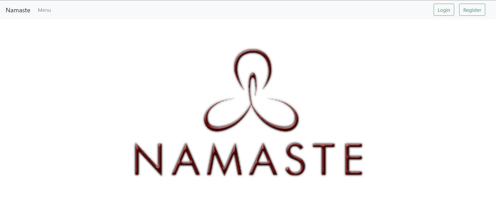
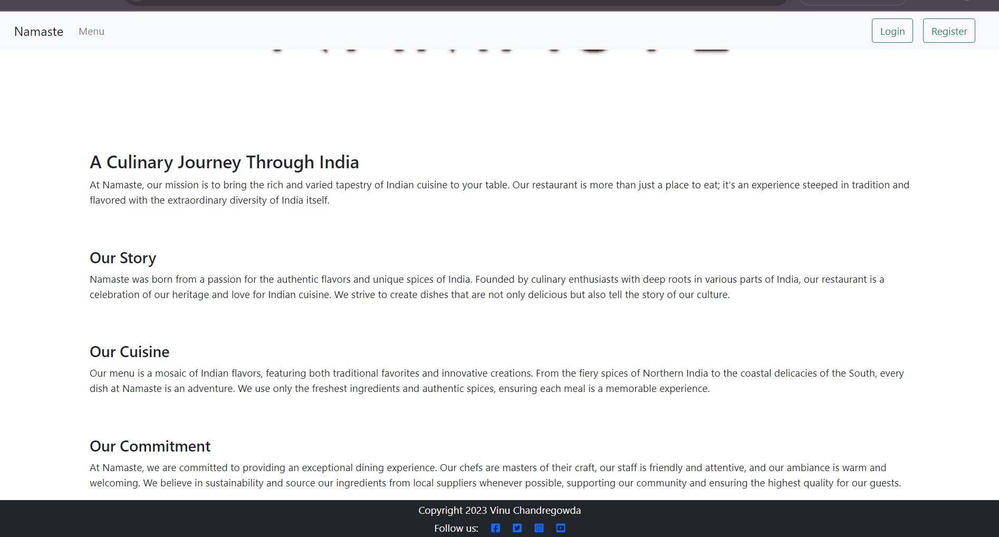
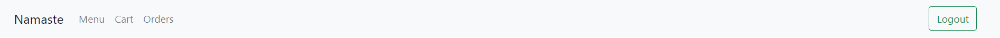
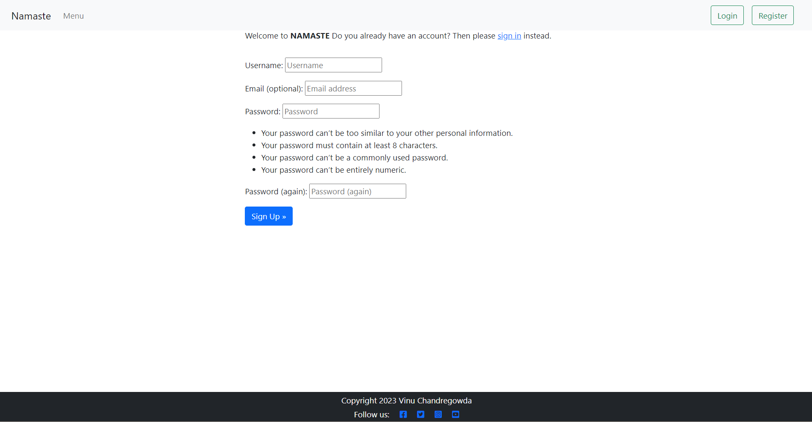
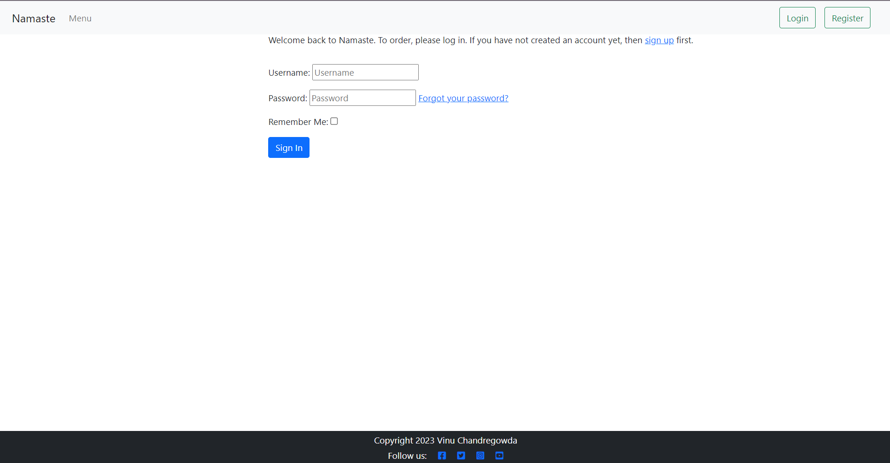
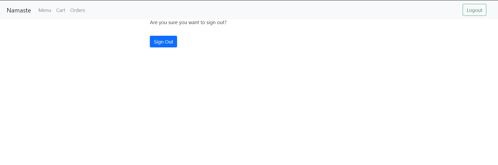
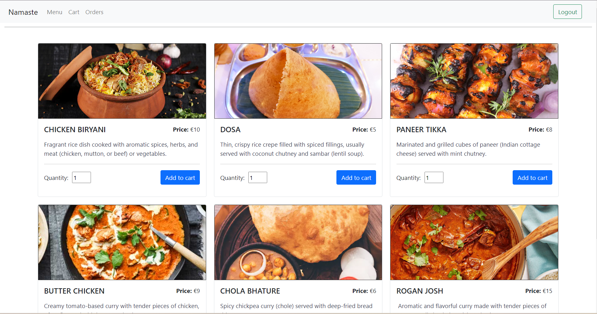
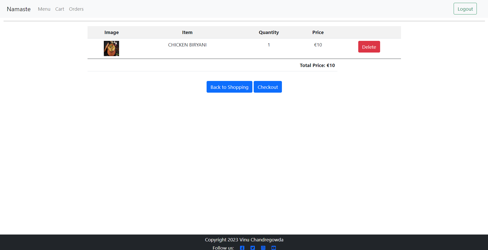
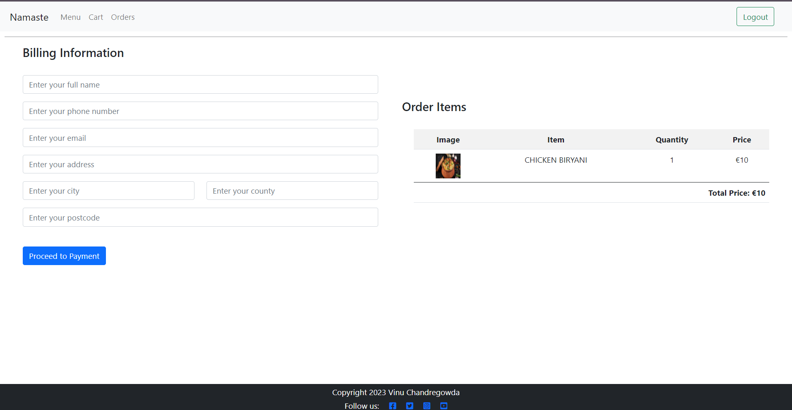

# Namaste

💻 [Visit live website](https://project5-food-eff6062cfe83.herokuapp.com/)   
(Ctrl + click to open in new tab)

## Table of Contents
  - [Executive Summary](#executive-summary)
     - [Marketing and Sales Strategy](#marketing-and-sales-strategy)
  - [Marketing](#marketing)
     - [Social Media](#social-media)
     - [Mailing List](#mailing-list)
  - [User Goals](#user-goals)
  - [Site Owner Goals](#site-owner-goals)
  - [User Experience](#user-experience)
  - [User Stories](#user-stories)
  - [Design](#design)
    - [Structure](#structure)
      - [Website pages](#website-pages)
      - [Database](#database)
      - [Models](#models)
  - [Technologies Used](#technologies-used)
  - [Features](#features)
  - [Deployment](#deployment)
  - [Credits](#credits)
  - [Acknowledgements](#acknowledgements)

  ## Business Plan  
### Executive Summary:

#### Introduction
One-stop destination for convenient and delicious online food ordering. we believe that enjoying great food should be hassle-free, and our platform is designed to make your dining experience seamless and enjoyable.

Whether you're craving a hearty meal, a quick snack, or something sweet to satisfy your dessert cravings, Project5 Food has you covered. Our extensive selection of food items caters to a variety of tastes and preferences, ensuring there's something for everyone.

With our user-friendly interface, browsing through our menu, adding items to your cart, and placing your order is simple and straightforward. Plus, our responsive design ensures that you can access  anytime, anywhere, from your desktop, laptop, or mobile device.

Experience the convenience of online food ordering with Namaste. Discover new flavors, indulge in your favorites, and let us take care of the rest. Whether you're dining solo, with family, or hosting a gathering, Namste is here to make every meal memorable.

### Marketing and Sales Strategy:

1. Digital Presence:
Our primary channel for reaching consumers is through digital platforms. Namaste will maintain an active online presence through various social media platforms such as Instagram, Facebook, and Twitter, leveraging the power of sponsored ads and organic content to attract and engage consumers

2. SEO and Content Marketing:
Namste website will be a strategic tool for organic growth. Utilizing SEO-friendly articles that cover a variety of topics around coffee culture and brewing techniques

## Marketing

### Social Media
namaste maintains active Facebook accounts to engage with our community and keep them updated on new products, promotions, and food culture. Both platforms are strategically used to boost awareness and drive traffic to our e-commerce site. Periodic analytics reviews guide our content and promotional strategies to continually grow and serve our community better

[Visit Facebook Page](https://www.facebook.com/profile.php?id=61555961382817)  
(Ctrl + click to open in new tab)

Facebook Page

Facebook Page deatils

## User Goals

- General: Easy navigation, accurate information
- Product Page: Detailed product info, clear images, reviews and ratings
- Cart Page: Simple checkout, edit and review options

## Site Owner Goals

- Achieve consistent user growth while maintaining strong user engagement
- Product Page: Encourage product sales, collect user reviews
- Contact Page: Generate leads, offer excellent customer service
- Cart Page: Maximize conversions, minimize cart abandonment

## User Experience

### Target Audience
The primary target audience for Namaste consists of food enthusiasts spanning various age groups, particularly those between the ages of 25 and 50. These individuals value quality and origin-specific coffees and are willing to invest a bit more in their daily brew.

### User Requirements and Expectations
- Easy navigation through the website to find products and contact information
- Secure and straightforward checkout process
- Access to detailed product descriptions and high-quality images
- Responsive design that offers a seamless experience across various devices
- Efficient search functionality to quickly locate desired products or information
- A user-friendly profile section to track orders and manage personal information
- Quick and accessible customer support through a Contact us page.
- Option to subscribe to a newsletter for updates and promotions

## User Stories

### Viewing and Navigation

1. As a Shopper I can use a navbar, footer, and social icons so that I can easily navigate the site
2. As a Shopper I can be notified of my actions so that I can be notified if my action was a success or not
3. As a Shopper, I want to see my login status (logged in or logged out) displayed on the website, so I can easily understand my current session status
4. As a Shopper I can navigate to the shopping pages so that I can view all products available
5. As a Shopper I can view product's details so that I can see more information about a product
6. As a Shopper I can view a preview of my cart and grand total at any time so that I can know what I am purchasing and cost

### User Accounts

7. As a Site User I can login and logout so that I can access my account easily
8. As a Site User I can register for an account so that I can view my profile and orders
9. As a Site User I can recover my password so that I can set a new password in case its forgotten
10. As a Site User I can have a profile so that I can store my information and order history so that I can checkout faster on my next shop

### Sort and Search 

12. As a Shopper I can search for a product by name or description so that I can find a specific product
13. As a Shopper I can sort by category so that I can select products of a specific category
14. As a Shopper I can sort by price so that I can select products of a specific price range (low-high/high-low)
15. As a Shopper I can see my search results so that I can shop a specific product

### Cart and Payment

16. As a Shopper I can view products in my cart so that I can review my cart before checkout
17. As a Shopper I can select the quantity of a product so that I can buy more of a certain product
18. As a Shopper I can adjust item quantity my bag so that I can add or remove more quantities to my bag
19. As a Shopper I can receive order confirmation so that I can be notified of a successful purchase
20. As a Shopper I can receive email confirmation so that I can have a receipt of my purchase

### Admin Functionality

21. As a Store Owner I can add a product so that I can add new products to the shop
22. As a Store Owner I can edit a product so that I can edit existing products in the shop
23. As a Store Owner I can delete a product so that I can delete existing products from the shop

# Structure

The site was structured using a basic logo and navigation layout showing all relevant links
 and hamburger menu for smaller devices. The footer consists of 3 social media links and 
email sign up form and useful links as well as contact information.

## Website pages

- The site consists of the following pages:
  - Home
  - Orders
  - Order Details
  - Cart
  - Checkout
  - Checkout Success
  - Login
  - Register
  - Logout
  - Reset Password

## Elephant sql 

I am using Elephant sql buckets to store my data.

## Database

I built my database using PostgreSQL. I have opted for PostgreSQL as my database
 management system, owing to its robust, reliable, and high-performing open-source
 architecture. It serves as a versatile platform for adeptly handling and structuring
 my data.

## Models

### User Model

| Key        | Name         | Type        |
| ---------- | ------------ | ----------- |
| PrimaryKey | user_id      | AutoField   |
|            | password     | VARCHAR(45) |
|            | last_login   | VARCHAR(45) |
|            | is_superuser | BOOLEAN     |
|            | username     | VARCHAR(45) |
|            | first_name   | VARCHAR(45) |
|            | last_name    | VARCHAR(45) |
|            | email        | VARCHAR(45) |
|            | is_staff     | BOOLEAN     |
|            |              |             |
|            | is_active    | BOOLEAN     |
|            | date_joined  | VARCHAR(45) |

### Product Model

| Key        | Name        | Type           |
| ---------- | ----------- | -------------- |
| PrimaryKey | product_id  | AutoField      |
|            | code        | CharField[50]  |
|            | brand       | CharField[50]  |
|            | name        | CharField[50]  |
|            | description | TextField      |
|            | has_sizes   | BooleanField   |
|            | price       | DecimalField   |
|            | inventory   | IntegerField   |
| ForeignKey | category    | Category model |
|            | rating      | DecimalField   |
|            | image       | ImageField     |

### Order Model

| Key        | Name            | Type               |
| ---------- | --------------- | ------------------ |
| PrimaryKey | order_id        | AutoField          |
|            | order_number    | CharField[40]      |
| ForeignKey | user_profile    | User profile Model |
|            | full_name       | CharField[50]      |
|            | email           | EmailField[254]    |
|            | phone_number    | CharField[20]      |
|            | address1        | CharField[80]      |
|            | address2        | CharField[80]      |
|            | town_city       | CharField[40]      |
|            | postcode        | CharField[20]      |
|            | county          | CharField[80]      |
|            | country         | CharField[40]      |
|            | date            | DateTimeField      |
|            | delivery_cost   | DecimalField[6]    |
|            | order_total     | DecimalField[10]   |
|            | grand_total     | DecimalField[10]   |
|            | original_bag    | TextField          |
|            | stripe_pid      | CharField          |

### OrderLineItem Model  

| Key        | Name             | Type            |
| ---------- | ---------------- | --------------- |
| PrimaryKey | OrderLineItem_id | AutoField       |
| ForeignKey | order            | Order Model     |
| ForeignKey | product          | Product Model   |
|            | product_size     | CharField[2]    |
|            | quantity         | IntegerField    |
|            | line_item_total  | DecimalField[6] |

### ContactUs Model

| Key        | Name         | Type             |
| ---------- | ------------ | ---------------- |
| PrimaryKey | message_id   | AutoField        |
|            | created_date | DateTimeField    |
| ForeignKey | user         | User model       |
|            | name         | CharField        |
|            | email        | EmailField       |
|            | phone        | PhoneNumberField |
|            | body         | TextField        |  

## **Technologies Used**

### **Languages Used**

-   [HTML5](https://en.wikipedia.org/wiki/HTML5)
-   [CSS3](https://en.wikipedia.org/wiki/Cascading_Style_Sheets)
-   [Python](https://www.python.org/)
-   [jQuery](https://jquery.com/)

### **Frameworks, Libraries & Programs Used**
* [Git](https://git-scm.com/) for version control.
* [GitHub](https://github.com/) to store the project files.
* [Canva](https://www.canva.com/) to create the wireframes.
* [Django](https://www.djangoproject.com/) as the Python Framework.
* [Heroku](https://www.heroku.com/home/) to deploy the website.
* [ElephantSQL](https://www.elephantsql.com/) to host the database.
* [Cloudinary](https://cloudinary.com/) to host images
* [Django-allauth](https://django-allauth.readthedocs.io/en/latest/) to create accounts.
* [Django Crispy Forms](https://django-crispy-forms.readthedocs.io/en/latest/) to create the forms based on the models.
* [Gunicorn](https://gunicorn.org/) as the webserver to host Django on Heroku.
* [dj-database-url](https://pypi.org/project/dj-database-url/) to create DATABASE_URL to configure the Django application.
* [psycopg2](https://pypi.org/project/psycopg2/) as PostgreSQL adapter.
* [Tables Generator](https://www.tablesgenerator.com/markdown_tables) to create tables.
* [RandomKeyGen](https://randomkeygen.com/) to create the SECRET_KEY for the project.
* [Google Fonts](https://fonts.google.com/) to import the fonts used on the website.
* [Bootstrap](https://getbootstrap.com/) for layout.
* [Lucidchart](https://lucid.app/) for database schema.
* [Cloudinary](https://cloudinary.com/) used for hosting images
* [Stripe](https://stripe.com/) to enable secure payment processing capabilities
* [ElephantSQL](https://www.elephantsql.com/) to host the applications Postgres database
* [Heroku](https://www.heroku.com/) used to host the deployed back-end site

---
 

## Features

### Search Engine Optimisation (SEO)

In the HTML structure of my web application's pages, I have incorporated meta tags to
enhance search engine optimization (SEO). Specifically, the 'description' tag offers a concise overview of the page's content aiding users and search engines alike.
Concurrently, the 'keywords' tag enumerates pertinent terms, thereby assisting
search engines in contextualizing the webpage and aligning it with related search queries.

### Home page

- Home page contains navigation bar, a main body, and a footer

See Feature

### Navigation Bar

- Fully Responsive.
- Custom logo for the business
- Consists of Home, Menu,, Contact Us, cart, Register, and Login
- Indicates login/logout in status.
- Displayed on all pages.

See Feature

### Footer

- Contains social media links, copyright, and contact information.
- A Facebook and Instagram page for the business is used.
- Displayed across all pages.

### Sign up / Register
- Contains form for users to register an account
- All fields are required for registration

See Feature

### Sign In
- User can login here

See Feature

### Sign Out
- Allows the user to securely sign out.
- Ask user if they are sure they want to sign out.

See Feature

### Menu
- Allows the user to view the listed products in the shop
- Products can be filtered by category, name, price, or rating
- Allows to add, edit, and delete new or existing products. 

See Feature

### Cart
- Allows the user to view the basket with their items
- When adding to bag, a popup will show preview of current bag
### Add, Edit, Delete Product
- Allows the admin to add, edit, and delete new or existing products.  

See Feature

### Checkout
- Allows the user to purchase items in their basket
- Users use stripe for card payments.
- On successful purchace, user will receive conformation email

See Feature

## **Deployment**

## **Remote Deployment**

### **ElephantSQL**

1. Navigate to ElephantSQL.com and create a user account, by using the log-in with GitHub option.
2. Click “Create New Instance”.
3. Set up your plan. (You can leave the 'tags' field blank.)
4. Select a region.
5. Select a data centre near you
6. Then click “Review”.
7. Check your details are correct and then click “Create instance”.
8. Return to the ElephantSQL dashboard and click on the database instance name for this project
9. In the URL section, clicking the copy icon will copy the database URL to your clipboard

Before deploying, run 'pip3 freeze > requirements.txt' on the terminal of your IDE of choice.

The site was deployed to Heroku. The steps to deploy are as follows: 
  1. Create an account and log in your [Heroku](https://id.heroku.com/login) account. 
  2. On the dashboard, click on the button New -> Create new app on the right side of the page.
  3. Choose a name and select your region. Click on Create app.
  4. Go to the Settings tab. Scroll down to Config Vars. 
  - Add key PORT and value 8000.
  - Add key DATABASE_URL and add the value of your database on ElephantSQL or other host of choice.
  - Add key CLOUDINARY_URL and add the value of your cloudinary host link.
  - Add key SECRET_KEY and add the value of your choice for this secret key.
  - Add key STRIPE_PUBLIC_KEY and add the value of your choice for this secret key.
  - Add key STRIPE_SECRET_KEY and add the value of your choice for this secret key.
  - Add key STRIPE_WH_SECRET and add the value of your choice for this secret key.
 
  5. Go to the Deploy tab. Select GitHub as Deployment Method. Connect your account.
  6. Enter the name of the repository that you forked, search and connect.
  7. Select the branch and click Deploy Branch.

The live link can be found here - [https://github.com/vinuc49/project5_django](https://project5-food-eff6062cfe83.herokuapp.com/)

## **Local Deployment**

### **How to Fork**

  1. Log In or Sign Up to GitHub.
  2. Go to this project repository [https://github.com/vinuc49/project5_django](https://github.com/vinuc49/project5_django)
  2. On the top right of the page, there's a button with the option Fork. Click on it.
  3. A new page, "Create a new fork", will open. If you wish, you can edit the name.
  4. At the end of the page, click on "Create fork".
  5. Now, you have a copy of the project in your repositories.

### **How to Clone**

  1. Log In or Sign Up to GitHub.
  2. Go to this project repository [https://github.com/vinuc49/project5_django](https://github.com/vinuc49/project5_django)
  3. Click on the Code button and select if you would like to clone with HTTPS, SSH or GitHub CLI and copy the link.
  4. Open the terminal in the code editor of your choice and change the current working directory to the one you will use for to clone the repository.
  5. Type 'git clone' into the terminal and then paste the link you copied before and press Enter.

### **Using Gitpod**

If you would like to edit your copy of this repository on Gitpod, you will need to: 
  1. On your browser of choice, install the Gitpod extension/add-on.
  2. On GitHub, open the project repository you forked before.
  3. On the top of the page, over the files, there is a green button on the right side of the page saying "Gitpod". Click it.
  4. It will open the Gitpod website. On the first time, you will select to connect with your GitHub account and Authorize gitpod-io. After that, you'll create an account.
  5. It might take a while after that because Gitpod will create your workspace.
  After the workspace is loaded, you can edit it on Gitpod.
---
 

## **Credits**

- Boutique Ado project was used as a base in development of this website

 

## **Acknowledgments**

- I would like to thank my Code Institute mentor for his support and feedback throughout this project.
- I would like to thank my spouse for her understanding, patience, and support while I developed this project.
- I would like to thank to Code Institute tutors. Developing this project I used tutors support a lot. Thanks a million, guys, for your patience, attention, help, and support. 
